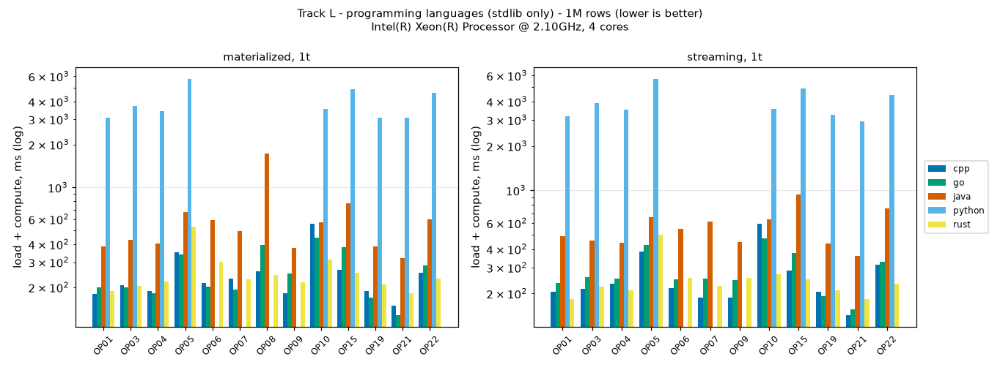
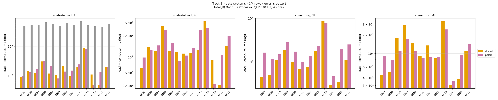
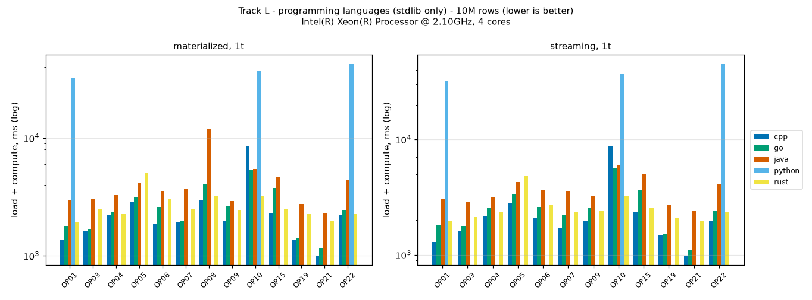
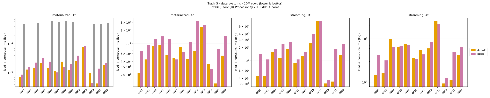

# Benchmark report (generated - do not edit by hand)

Generated by `report/make_charts.py` from `results/raw/*.jsonl`. **Rankings are per operation, per size, per mode and per thread count; Track L and Track S are never ranked against each other.** There is no overall winner.

## Environment

Intel(R) Xeon(R) Processor @ 2.10GHz, 4 cores, 15.72 GB RAM, Linux 6.18.44-fc-v51; container limits: none; single-thread runs pinned with `taskset`; page cache: warm (data generated just before the runs). One machine, one run campaign - see *Threats to validity*.

## How to read the tables

* `load` = read+parse into memory (Track L) or table load / file scan (Track S); `compute` = the operation; values are medians of the timed runs after one warm-up. OP15 reports parsing as `compute` (load = 0).
* **Rank is by `load + compute`** (in-process end-to-end). Ranking by `compute` alone would reward implementations that move work into `load` (e.g. dictionary-encoding strings while parsing). The compute-only rank is shown in parentheses.
* Dense ranks; entries within max(5%, IQR) of the rank's anchor share the rank. `noisy` = IQR/median > 10%.
* `RSS` = peak resident memory of the process (includes the language/engine runtime).

## 1M rows

### Track L - programming languages (stdlib only)

#### materialized, 1 thread

| op | cpp | go | java | python | rust |
|---|---|---|---|---|---|
| OP01 scan+aggregate | **#1** (1) 180.5 load 178.3 + compute 2.2; 123 MB; noisy | **#1** (1) 198.7 load 195.9 + compute 2.7; 122 MB; noisy | **#2** (2) 386.4 load 372.5 + compute 13.8; 266 MB; noisy | **#3** (3) 3.06 s load 3.01 s + compute 50.5; 203 MB | **#1** (1) 189.2 load 186.7 + compute 2.6; 124 MB; noisy |
| OP03 group-by low-card | **#1** (1) 206.3 load 203.1 + compute 3.1; 126 MB | **#1** (1) 199.9 load 196.5 + compute 3.4; 125 MB; noisy | **#2** (2) 428.3 load 411.8 + compute 16.5; 269 MB; noisy | **#3** (4) 3.72 s load 3.15 s + compute 576.0; 255 MB; noisy | **#1** (3) 203.8 load 177.8 + compute 26.0; 139 MB |
| OP04 group-by high-card | **#1** (2) 188.5 load 139.6 + compute 48.8; 125 MB | **#1** (3) 182.1 load 121.2 + compute 60.9; 152 MB | **#2** (4) 403.4 load 324.4 + compute 79.0; 268 MB; noisy | **#3** (5) 3.43 s load 3.04 s + compute 385.4; 224 MB | **#1** (1) 219.9 load 202.8 + compute 17.1; 123 MB; noisy |
| OP05 group-by 3 keys | **#1** (1) 352.2 load 229.6 + compute 122.5; 128 MB; noisy | **#1** (2) 340.3 load 196.8 + compute 143.5; 160 MB; noisy | **#3** (1) 674.1 load 563.7 + compute 110.4; 272 MB | **#4** (4) 5.74 s load 3.34 s + compute 2.40 s; 329 MB | **#2** (3) 530.3 load 234.6 + compute 295.7; 154 MB |
| OP06  | **#1** (2) 214.7 load 187.6 + compute 27.0; 134 MB; noisy | **#1** (2) 202.1 load 175.5 + compute 26.7; 136 MB | **#3** (3) 589.5 load 545.9 + compute 43.6; 296 MB | - | **#2** (1) 302.0 load 287.6 + compute 14.4; 137 MB |
| OP07  | **#2** (2) 229.3 load 209.6 + compute 19.8; 137 MB; noisy | **#1** (2) 192.0 load 171.0 + compute 21.0; 139 MB; noisy | **#3** (3) 494.4 load 450.1 + compute 44.3; 302 MB | - | **#2** (1) 226.9 load 217.9 + compute 9.0; 135 MB; noisy |
| OP08  | **#1** (2) 258.3 load 170.5 + compute 87.8; 125 MB; noisy | **#2** (3) 394.0 load 224.7 + compute 169.3; 139 MB | **#3** (4) 1.72 s load 480.5 + compute 1.24 s; 268 MB | - | **#1** (1) 244.5 load 198.5 + compute 46.0; 123 MB; noisy |
| OP09  | **#1** (2) 181.6 load 140.5 + compute 41.1; 125 MB; noisy | **#2** (3) 251.1 load 188.2 + compute 62.9; 137 MB | **#3** (3) 376.2 load 310.1 + compute 66.1; 268 MB | - | **#1** (1) 217.2 load 202.6 + compute 14.6; 123 MB |
| OP10 distinct counts | **#3** (4) 557.2 load 189.7 + compute 367.5; 132 MB; noisy | **#2** (3) 446.2 load 188.5 + compute 257.6; 208 MB; noisy | **#3** (2) 570.9 load 404.2 + compute 166.8; 276 MB; noisy | **#4** (4) 3.56 s load 3.22 s + compute 340.7; 262 MB | **#1** (1) 311.0 load 229.3 + compute 81.7; 131 MB; noisy |
| OP15 CSV parse | **#1** (1) 264.2 load 0.0 + compute 264.2; 110 MB | **#2** (2) 382.2 load 0.0 + compute 382.2; 108 MB | **#3** (3) 772.1 load 0.0 + compute 772.1; 252 MB; noisy | **#4** (4) 4.87 s load 0.0 + compute 4.87 s; 171 MB | **#1** (1) 252.6 load 0.0 + compute 252.6; 108 MB |
| OP19 NULL handling | **#1** (1) 188.7 load 185.7 + compute 3.0; 118 MB; noisy | **#1** (1) 170.2 load 167.5 + compute 2.6; 117 MB | **#3** (2) 387.1 load 372.3 + compute 14.7; 261 MB; noisy | **#4** (4) 3.06 s load 2.83 s + compute 229.5; 225 MB | **#2** (3) 209.0 load 183.5 + compute 25.5; 131 MB |
| OP21 decimal vs float | **#2** (1) 149.5 load 145.3 + compute 4.1; 117 MB | **#1** (2) 128.1 load 123.5 + compute 4.6; 116 MB | **#4** (4) 318.8 load 281.0 + compute 37.8; 260 MB; noisy | **#5** (5) 3.08 s load 3.01 s + compute 74.0; 190 MB | **#3** (3) 182.4 load 177.4 + compute 5.0; 116 MB |
| OP22 type round trips | **#2** (1) 254.2 load 240.4 + compute 13.7; 144 MB | **#3** (1) 283.4 load 270.4 + compute 13.0; 143 MB | **#4** (3) 598.2 load 564.0 + compute 34.2; 287 MB | **#5** (4) 4.58 s load 4.33 s + compute 249.4; 358 MB | **#1** (2) 230.0 load 211.3 + compute 18.8; 142 MB |

#### streaming, 1 thread

| op | cpp | go | java | python | rust |
|---|---|---|---|---|---|
| OP01 scan+aggregate | **#2** (1) 204.7 load 202.3 + compute 2.4; 124 MB | **#3** (1) 237.0 load 234.5 + compute 2.5; 178 MB | **#4** (3) 489.2 load 476.7 + compute 12.5; 253 MB | **#5** (4) 3.19 s load 3.14 s + compute 50.0; 204 MB | **#1** (2) 183.5 load 179.2 + compute 4.3; 124 MB |
| OP03 group-by low-card | **#1** (2) 214.0 load 210.7 + compute 3.3; 129 MB; noisy | **#2** (1) 258.7 load 255.9 + compute 2.9; 193 MB | **#3** (3) 459.4 load 444.7 + compute 14.7; 254 MB | **#4** (5) 3.91 s load 3.34 s + compute 575.8; 256 MB | **#1** (4) 222.5 load 196.3 + compute 26.2; 139 MB |
| OP04 group-by high-card | **#2** (2) 232.5 load 179.5 + compute 53.0; 149 MB | **#3** (3) 252.6 load 189.2 + compute 63.3; 216 MB | **#4** (3) 444.1 load 358.1 + compute 86.0; 254 MB; noisy | **#5** (4) 3.52 s load 3.08 s + compute 442.1; 224 MB | **#1** (1) 209.6 load 193.3 + compute 16.3; 123 MB |
| OP05 group-by 3 keys | **#1** (1) 384.6 load 270.3 + compute 114.3; 159 MB | **#2** (2) 427.8 load 289.5 + compute 138.4; 214 MB | **#4** (1) 656.6 load 547.2 + compute 109.4; 254 MB | **#5** (4) 5.68 s load 3.39 s + compute 2.29 s; 339 MB | **#3** (3) 497.8 load 216.1 + compute 281.7; 154 MB; noisy |
| OP06  | **#1** (3) 217.8 load 188.9 + compute 28.9; 145 MB; noisy | **#2** (2) 250.5 load 226.0 + compute 24.6; 216 MB | **#3** (4) 548.4 load 503.3 + compute 45.1; 277 MB; noisy | - | **#2** (1) 254.8 load 240.0 + compute 14.8; 137 MB; noisy |
| OP07  | **#1** (3) 188.1 load 167.1 + compute 21.0; 145 MB | **#2** (2) 251.3 load 233.9 + compute 17.4; 224 MB; noisy | **#3** (4) 612.6 load 569.2 + compute 43.4; 281 MB | - | **#2** (1) 225.0 load 216.0 + compute 9.1; 135 MB; noisy |
| OP09  | **#1** (2) 187.3 load 150.6 + compute 36.8; 132 MB | **#2** (3) 246.9 load 187.1 + compute 59.9; 201 MB; noisy | **#3** (4) 444.2 load 366.1 + compute 78.1; 254 MB; noisy | - | **#2** (1) 254.7 load 238.9 + compute 15.8; 123 MB; noisy |
| OP10 distinct counts | **#2** (4) 595.7 load 192.0 + compute 403.7; 178 MB; noisy | **#2** (3) 472.4 load 251.4 + compute 221.0; 229 MB; noisy | **#3** (2) 634.0 load 445.8 + compute 188.2; 280 MB; noisy | **#4** (4) 3.56 s load 3.24 s + compute 319.4; 262 MB | **#1** (1) 271.2 load 202.3 + compute 68.9; 131 MB |
| OP15 CSV parse | **#2** (2) 285.0 load 0.0 + compute 285.0; 110 MB | **#3** (3) 376.8 load 0.0 + compute 376.8; 108 MB | **#4** (4) 936.9 load 0.0 + compute 936.9; 252 MB; noisy | **#5** (5) 4.88 s load 0.0 + compute 4.88 s; 172 MB | **#1** (1) 250.6 load 0.0 + compute 250.6; 108 MB |
| OP19 NULL handling | **#2** (2) 204.7 load 201.7 + compute 3.0; 119 MB | **#1** (1) 192.5 load 189.8 + compute 2.7; 154 MB | **#3** (3) 434.7 load 419.5 + compute 15.2; 253 MB; noisy | **#4** (5) 3.26 s load 3.00 s + compute 263.3; 225 MB | **#2** (4) 209.3 load 183.5 + compute 25.8; 131 MB |
| OP21 decimal vs float | **#1** (2) 143.2 load 139.2 + compute 4.0; 118 MB | **#2** (1) 157.1 load 153.5 + compute 3.6; 148 MB | **#4** (4) 359.7 load 321.8 + compute 38.0; 253 MB | **#5** (5) 2.94 s load 2.86 s + compute 77.8; 189 MB | **#3** (3) 182.9 load 177.8 + compute 5.0; 116 MB |
| OP22 type round trips | **#2** (2) 314.6 load 300.9 + compute 13.7; 148 MB | **#2** (1) 327.0 load 314.4 + compute 12.5; 215 MB | **#3** (4) 751.8 load 714.7 + compute 37.2; 261 MB | **#4** (5) 4.42 s load 4.16 s + compute 257.4; 358 MB | **#1** (3) 233.1 load 209.1 + compute 24.0; 142 MB; noisy |

### Track S - data systems

#### materialized, 1 thread

| op | duckdb | polars | sqlite |
|---|---|---|---|
| OP01 scan+aggregate | **#1** (1) 91.1 load 77.5 + compute 13.6; 77 MB; noisy | **#1** (2) 100.6 load 44.0 + compute 56.6; 107 MB; noisy | **#2** (3) 4.95 s load 4.78 s + compute 169.1; 104 MB; noisy |
| OP03 group-by low-card | **#1** (1) 143.0 load 104.7 + compute 38.3; 90 MB | **#1** (2) 131.2 load 43.6 + compute 87.6; 133 MB | **#2** (3) 5.27 s load 4.60 s + compute 666.8; 105 MB |
| OP04 group-by high-card | **#1** (1) 124.3 load 58.0 + compute 66.3; 96 MB | **#2** (2) 167.6 load 40.3 + compute 127.3; 122 MB | **#3** (3) 5.15 s load 4.64 s + compute 509.8; 117 MB |
| OP05 group-by 3 keys | **#1** (1) 305.0 load 144.9 + compute 160.1; 139 MB; noisy | **#1** (2) 312.3 load 53.1 + compute 259.2; 218 MB; noisy | **#2** (3) 6.44 s load 4.55 s + compute 1.89 s; 128 MB |
| OP06  | **#1** (1) 119.5 load 78.5 + compute 41.0; 96 MB | **#2** (2) 213.8 load 59.8 + compute 153.9; 167 MB | **#3** (3) 5.56 s load 4.83 s + compute 729.8; 107 MB |
| OP07  | **#2** (1) 109.5 load 89.5 + compute 19.9; 97 MB | **#1** (2) 82.3 load 49.9 + compute 32.5; 106 MB | **#3** (3) 4.80 s load 4.32 s + compute 481.1; 107 MB |
| OP08  | **#2** (2) 216.1 load 57.6 + compute 158.5; 121 MB | **#1** (1) 139.6 load 35.0 + compute 104.6; 117 MB | **#3** (3) 6.09 s load 4.74 s + compute 1.35 s; 107 MB |
| OP09  | **#1** (1) 96.8 load 62.5 + compute 34.3; 84 MB | **#2** (2) 152.1 load 45.9 + compute 106.2; 114 MB; noisy | **#3** (3) 5.26 s load 4.78 s + compute 477.9; 105 MB |
| OP10 distinct counts | **#1** (1) 195.6 load 75.8 + compute 119.8; 125 MB | **#2** (2) 243.1 load 22.6 + compute 220.5; 256 MB | **#3** (3) 6.94 s load 4.39 s + compute 2.55 s; 105 MB |
| OP15 CSV parse | **#1** (1) 862.9 load 0.0 + compute 862.9; 120 MB | **#1** (1) 822.6 load 0.0 + compute 822.6; 316 MB | **#2** (2) 5.14 s load 0.0 + compute 5.14 s; 104 MB |
| OP19 NULL handling | **#2** (2) 111.0 load 71.9 + compute 39.2; 79 MB | **#1** (1) 50.0 load 18.1 + compute 31.9; 105 MB | **#3** (3) 4.75 s load 4.54 s + compute 207.8; 104 MB |
| OP21 decimal vs float | **#1** (1) 48.7 load 34.4 + compute 14.3; 67 MB; noisy | **#2** (3) 134.7 load 31.3 + compute 103.3; 119 MB | **#3** (2) 4.62 s load 4.54 s + compute 76.0; 103 MB |
| OP22 type round trips | **#1** (1) 198.2 load 158.7 + compute 39.5; 108 MB | **#1** (2) 197.5 load 70.1 + compute 127.4; 160 MB | **#2** (3) 5.70 s load 4.87 s + compute 829.1; 104 MB |

#### materialized, 4 threads

| op | duckdb | polars |
|---|---|---|
| OP01 scan+aggregate | **#1** (1) 70.5 load 63.6 + compute 6.9; 77 MB; noisy | **#2** (2) 98.3 load 38.3 + compute 60.1; 117 MB; noisy |
| OP03 group-by low-card | **#1** (1) 138.2 load 117.9 + compute 20.3; 90 MB; noisy | **#1** (2) 125.7 load 54.7 + compute 71.0; 165 MB |
| OP04 group-by high-card | **#1** (1) 122.5 load 48.3 + compute 74.2; 123 MB; noisy | **#1** (2) 144.9 load 36.8 + compute 108.1; 142 MB |
| OP05 group-by 3 keys | **#2** (1) 269.2 load 138.1 + compute 131.1; 198 MB | **#1** (2) 240.4 load 68.6 + compute 171.8; 235 MB |
| OP06  | **#1** (1) 123.3 load 93.2 + compute 30.1; 101 MB | **#2** (2) 158.6 load 48.6 + compute 110.0; 236 MB |
| OP07  | **#2** (1) 118.1 load 106.4 + compute 11.7; 98 MB; noisy | **#1** (2) 88.7 load 58.1 + compute 30.6; 128 MB |
| OP08  | **#1** (1) 111.8 load 56.9 + compute 54.9; 136 MB | **#1** (2) 105.3 load 39.6 + compute 65.7; 124 MB; noisy |
| OP09  | **#1** (1) 113.2 load 81.3 + compute 31.9; 106 MB; noisy | **#2** (2) 134.3 load 54.9 + compute 79.5; 135 MB |
| OP10 distinct counts | **#1** (1) 124.8 load 70.0 + compute 54.8; 135 MB | **#2** (2) 239.6 load 24.7 + compute 214.8; 273 MB; noisy |
| OP15 CSV parse | **#2** (2) 315.6 load 0.0 + compute 315.6; 168 MB | **#1** (1) 256.6 load 0.0 + compute 256.6; 314 MB |
| OP19 NULL handling | **#2** (1) 90.3 load 70.6 + compute 19.7; 79 MB; noisy | **#1** (2) 42.5 load 19.4 + compute 23.1; 107 MB |
| OP21 decimal vs float | **#1** (1) 40.5 load 33.4 + compute 7.1; 68 MB | **#2** (2) 107.8 load 34.8 + compute 73.0; 144 MB; noisy |
| OP22 type round trips | **#1** (1) 142.0 load 126.8 + compute 15.2; 111 MB; noisy | **#2** (2) 195.8 load 70.5 + compute 125.3; 219 MB |

#### streaming, 1 thread

| op | duckdb | polars |
|---|---|---|
| OP01 scan+aggregate | **#1** (1) 44.5 load 0.0 + compute 44.5; 57 MB | **#2** (2) 161.9 load 0.0 + compute 161.9; 87 MB |
| OP03 group-by low-card | **#1** (1) 50.2 load 0.0 + compute 50.2; 60 MB | **#2** (2) 115.0 load 0.0 + compute 115.0; 104 MB |
| OP04 group-by high-card | **#1** (1) 110.1 load 0.0 + compute 110.1; 78 MB; noisy | **#2** (2) 148.7 load 0.0 + compute 148.7; 108 MB |
| OP05 group-by 3 keys | **#1** (1) 182.3 load 0.0 + compute 182.3; 91 MB | **#2** (2) 279.6 load 0.0 + compute 279.6; 186 MB |
| OP06  | **#1** (1) 99.0 load 10.0 + compute 89.0; 71 MB | **#2** (2) 171.6 load 5.5 + compute 166.1; 109 MB |
| OP07  | **#1** (1) 67.5 load 11.4 + compute 56.2; 68 MB; noisy | **#2** (2) 97.7 load 9.2 + compute 88.5; 108 MB |
| OP09  | **#1** (1) 77.1 load 0.0 + compute 77.1; 66 MB | **#2** (2) 136.6 load 0.0 + compute 136.6; 98 MB |
| OP10 distinct counts | **#1** (1) 177.6 load 0.0 + compute 177.6; 91 MB; noisy | **#2** (2) 231.6 load 0.0 + compute 231.6; 180 MB |
| OP15 CSV parse | **#2** (2) 846.3 load 0.0 + compute 846.3; 120 MB | **#1** (1) 780.1 load 0.0 + compute 780.1; 173 MB |
| OP19 NULL handling | **#1** (1) 29.1 load 0.0 + compute 29.1; 57 MB; noisy | **#2** (2) 46.2 load 0.0 + compute 46.2; 80 MB |
| OP21 decimal vs float | **#1** (1) 35.2 load 0.0 + compute 35.2; 57 MB; noisy | **#2** (2) 191.6 load 0.0 + compute 191.6; 82 MB |
| OP22 type round trips | **#1** (1) 112.2 load 0.0 + compute 112.2; 62 MB | **#2** (2) 249.8 load 0.0 + compute 249.8; 118 MB |

#### streaming, 4 threads

| op | duckdb | polars |
|---|---|---|
| OP01 scan+aggregate | **#1** (1) 44.5 load 0.0 + compute 44.5; 57 MB | **#2** (2) 91.5 load 0.0 + compute 91.5; 95 MB |
| OP03 group-by low-card | **#1** (1) 50.0 load 0.0 + compute 50.0; 59 MB | **#2** (2) 78.0 load 0.0 + compute 78.0; 117 MB |
| OP04 group-by high-card | **#2** (2) 176.9 load 0.0 + compute 176.9; 109 MB | **#1** (1) 110.5 load 0.0 + compute 110.5; 123 MB |
| OP05 group-by 3 keys | **#2** (2) 287.6 load 0.0 + compute 287.6; 161 MB | **#1** (1) 172.4 load 0.0 + compute 172.4; 220 MB |
| OP06  | **#2** (2) 149.0 load 20.9 + compute 128.2; 76 MB | **#1** (1) 107.8 load 9.6 + compute 98.2; 150 MB |
| OP07  | **#1** (1) 90.4 load 25.0 + compute 65.4; 71 MB | **#1** (1) 84.0 load 16.6 + compute 67.4; 116 MB; noisy |
| OP09  | **#2** (2) 134.5 load 0.0 + compute 134.5; 90 MB; noisy | **#1** (1) 86.3 load 0.0 + compute 86.3; 115 MB; noisy |
| OP10 distinct counts | **#1** (1) 83.3 load 0.0 + compute 83.3; 89 MB | **#1** (1) 88.3 load 0.0 + compute 88.3; 199 MB; noisy |
| OP15 CSV parse | **#2** (2) 333.3 load 0.0 + compute 333.3; 167 MB | **#1** (1) 246.5 load 0.0 + compute 246.5; 270 MB |
| OP19 NULL handling | **#1** (1) 30.3 load 0.0 + compute 30.3; 56 MB | **#2** (2) 35.1 load 0.0 + compute 35.1; 95 MB; noisy |
| OP21 decimal vs float | **#1** (1) 37.8 load 0.0 + compute 37.8; 57 MB | **#2** (2) 94.5 load 0.0 + compute 94.5; 94 MB; noisy |
| OP22 type round trips | **#1** (1) 110.1 load 0.0 + compute 110.1; 62 MB | **#2** (2) 141.4 load 0.0 + compute 141.4; 119 MB |

## 10M rows

### Track L - programming languages (stdlib only)

#### materialized, 1 thread

| op | cpp | go | java | python | rust |
|---|---|---|---|---|---|
| OP01 scan+aggregate | **#1** (1) 1.37 s load 1.35 s + compute 21.9; 246 MB | **#2** (2) 1.77 s load 1.75 s + compute 27.5; 639 MB; noisy | **#3** (3) 2.97 s load 2.93 s + compute 41.5; 671 MB | **#4** (4) 32.13 s load 31.63 s + compute 501.0; 683 MB | **#2** (2) 1.94 s load 1.91 s + compute 25.6; 273 MB |
| OP03 group-by low-card | **#1** (1) 1.62 s load 1.59 s + compute 30.6; 274 MB | **#1** (1) 1.69 s load 1.66 s + compute 29.6; 600 MB; noisy | **#3** (1) 3.01 s load 2.96 s + compute 43.6; 719 MB | - | **#2** (2) 2.49 s load 2.22 s + compute 264.6; 417 MB |
| OP04 group-by high-card | **#1** (3) 2.23 s load 1.03 s + compute 1.20 s; 394 MB | **#1** (3) 2.37 s load 1.30 s + compute 1.08 s; 702 MB; noisy | **#2** (2) 3.27 s load 2.53 s + compute 736.2; 700 MB; noisy | - | **#1** (1) 2.26 s load 1.93 s + compute 332.3; 264 MB |
| OP05 group-by 3 keys | **#1** (2) 2.90 s load 1.99 s + compute 908.6; 303 MB; noisy | **#1** (3) 3.16 s load 1.96 s + compute 1.19 s; 680 MB | **#2** (1) 4.18 s load 3.60 s + compute 578.7; 859 MB; noisy | - | **#3** (4) 5.10 s load 2.29 s + compute 2.81 s; 570 MB |
| OP06  | **#1** (3) 1.86 s load 1.31 s + compute 557.2; 359 MB; noisy | **#2** (4) 2.61 s load 1.90 s + compute 712.3; 745 MB | **#4** (2) 3.57 s load 3.13 s + compute 441.0; 828 MB | - | **#3** (1) 3.04 s load 2.64 s + compute 404.1; 408 MB |
| OP07  | **#1** (2) 1.92 s load 1.48 s + compute 437.4; 387 MB | **#1** (2) 2.00 s load 1.53 s + compute 470.0; 756 MB; noisy | **#3** (2) 3.70 s load 3.25 s + compute 447.4; 947 MB | - | **#2** (1) 2.49 s load 2.35 s + compute 145.1; 394 MB |
| OP08  | **#1** (2) 2.98 s load 1.75 s + compute 1.23 s; 309 MB | **#2** (3) 4.09 s load 2.04 s + compute 2.05 s; 699 MB | **#3** (4) 11.95 s load 3.24 s + compute 8.71 s; 767 MB | - | **#1** (1) 3.24 s load 2.64 s + compute 598.2; 307 MB |
| OP09  | **#1** (3) 1.97 s load 1.06 s + compute 913.8; 265 MB; noisy | **#2** (4) 2.62 s load 1.22 s + compute 1.40 s; 699 MB; noisy | **#3** (2) 2.92 s load 2.41 s + compute 504.8; 700 MB | - | **#2** (1) 2.43 s load 2.13 s + compute 299.4; 264 MB |
| OP10 distinct counts | **#3** (5) 8.52 s load 1.51 s + compute 7.01 s; 611 MB | **#2** (3) 5.33 s load 1.77 s + compute 3.56 s; 777 MB | **#2** (2) 5.43 s load 3.30 s + compute 2.13 s; 954 MB | **#4** (4) 37.44 s load 31.56 s + compute 5.88 s; 2014 MB | **#1** (1) 3.20 s load 2.05 s + compute 1.15 s; 466 MB |
| OP15 CSV parse | **#1** (1) 2.32 s load 0.0 + compute 2.32 s; 220 MB | **#3** (3) 3.75 s load 0.0 + compute 3.75 s; 315 MB | **#4** (4) 4.69 s load 0.0 + compute 4.69 s; 570 MB | - | **#2** (2) 2.51 s load 0.0 + compute 2.51 s; 111 MB |
| OP19 NULL handling | **#1** (2) 1.36 s load 1.33 s + compute 32.2; 229 MB | **#1** (1) 1.40 s load 1.37 s + compute 25.9; 486 MB | **#3** (3) 2.75 s load 2.72 s + compute 38.1; 589 MB | - | **#2** (4) 2.26 s load 2.00 s + compute 261.2; 341 MB |
| OP21 decimal vs float | **#1** (1) 1.01 s load 963.0 + compute 45.2; 228 MB | **#2** (1) 1.17 s load 1.12 s + compute 44.6; 484 MB | **#4** (3) 2.33 s load 2.24 s + compute 88.8; 573 MB | - | **#3** (2) 2.00 s load 1.95 s + compute 50.3; 187 MB |
| OP22 type round trips | **#1** (1) 2.20 s load 2.06 s + compute 137.9; 456 MB; noisy | **#1** (1) 2.45 s load 2.32 s + compute 130.7; 781 MB | **#2** (2) 4.39 s load 4.18 s + compute 211.8; 1132 MB; noisy | **#3** (3) 42.43 s load 39.52 s + compute 2.92 s; 2268 MB | **#1** (2) 2.26 s load 2.04 s + compute 220.9; 454 MB |

#### streaming, 1 thread

| op | cpp | go | java | python | rust |
|---|---|---|---|---|---|
| OP01 scan+aggregate | **#1** (1) 1.30 s load 1.27 s + compute 23.4; 235 MB | **#2** (1) 1.83 s load 1.81 s + compute 23.3; 384 MB | **#3** (2) 3.03 s load 2.98 s + compute 43.5; 576 MB | **#4** (3) 32.09 s load 31.61 s + compute 478.7; 220 MB | **#2** (2) 1.96 s load 1.92 s + compute 39.9; 127 MB; noisy |
| OP03 group-by low-card | **#1** (2) 1.60 s load 1.57 s + compute 33.6; 239 MB | **#2** (1) 1.76 s load 1.73 s + compute 28.2; 397 MB | **#4** (3) 2.91 s load 2.85 s + compute 54.4; 582 MB; noisy | - | **#3** (4) 2.14 s load 1.88 s + compute 260.8; 142 MB |
| OP04 group-by high-card | **#1** (3) 2.15 s load 965.6 + compute 1.19 s; 366 MB | **#3** (4) 2.57 s load 1.26 s + compute 1.31 s; 525 MB | **#4** (2) 3.17 s load 2.31 s + compute 854.2; 624 MB; noisy | - | **#2** (1) 2.34 s load 1.94 s + compute 404.4; 176 MB |
| OP05 group-by 3 keys | **#1** (2) 2.82 s load 1.87 s + compute 952.9; 247 MB | **#2** (3) 3.33 s load 2.06 s + compute 1.27 s; 423 MB | **#3** (1) 4.28 s load 3.67 s + compute 616.3; 622 MB | - | **#4** (4) 4.82 s load 2.01 s + compute 2.81 s; 181 MB |
| OP06  | **#1** (3) 2.10 s load 1.38 s + compute 723.3; 297 MB | **#2** (3) 2.59 s load 1.86 s + compute 738.7; 579 MB; noisy | **#3** (2) 3.65 s load 3.11 s + compute 545.6; 574 MB | - | **#2** (1) 2.74 s load 2.34 s + compute 400.1; 202 MB |
| OP07  | **#1** (2) 1.73 s load 1.24 s + compute 482.5; 297 MB | **#2** (2) 2.22 s load 1.73 s + compute 486.4; 576 MB | **#3** (3) 3.59 s load 3.07 s + compute 521.1; 583 MB | - | **#2** (1) 2.34 s load 2.16 s + compute 178.5; 176 MB |
| OP09  | **#1** (3) 1.97 s load 972.2 + compute 997.4; 267 MB | **#3** (4) 2.55 s load 1.21 s + compute 1.34 s; 434 MB | **#4** (2) 3.22 s load 2.51 s + compute 711.8; 616 MB | - | **#2** (1) 2.38 s load 2.03 s + compute 355.6; 160 MB |
| OP10 distinct counts | **#3** (5) 8.68 s load 1.44 s + compute 7.24 s; 514 MB | **#2** (3) 5.69 s load 1.79 s + compute 3.90 s; 576 MB | **#2** (2) 5.98 s load 3.72 s + compute 2.26 s; 914 MB | **#4** (4) 37.23 s load 30.91 s + compute 6.32 s; 1262 MB | **#1** (1) 3.27 s load 1.99 s + compute 1.28 s; 260 MB |
| OP15 CSV parse | **#1** (1) 2.36 s load 0.0 + compute 2.36 s; 220 MB | **#3** (3) 3.69 s load 0.0 + compute 3.69 s; 317 MB | **#4** (4) 5.00 s load 0.0 + compute 5.00 s; 566 MB | - | **#2** (2) 2.56 s load 0.0 + compute 2.56 s; 111 MB |
| OP19 NULL handling | **#1** (2) 1.49 s load 1.46 s + compute 30.8; 230 MB | **#1** (1) 1.51 s load 1.48 s + compute 26.4; 355 MB | **#3** (3) 2.69 s load 2.64 s + compute 49.6; 567 MB; noisy | - | **#2** (4) 2.11 s load 1.84 s + compute 266.2; 134 MB |
| OP21 decimal vs float | **#1** (1) 989.3 load 947.2 + compute 42.1; 228 MB | **#2** (1) 1.11 s load 1.07 s + compute 42.7; 348 MB | **#4** (3) 2.38 s load 2.28 s + compute 97.2; 565 MB | - | **#3** (2) 1.96 s load 1.91 s + compute 50.1; 119 MB |
| OP22 type round trips | **#1** (1) 1.95 s load 1.81 s + compute 141.0; 258 MB | **#2** (1) 2.40 s load 2.26 s + compute 135.1; 427 MB | **#3** (3) 4.07 s load 3.84 s + compute 236.6; 659 MB | **#4** (4) 45.02 s load 42.02 s + compute 3.00 s; 386 MB | **#2** (2) 2.34 s load 2.13 s + compute 215.0; 145 MB |

### Track S - data systems

#### materialized, 1 thread

| op | duckdb | polars | sqlite |
|---|---|---|---|
| OP01 scan+aggregate | **#1** (1) 710.2 load 593.7 + compute 116.5; 256 MB | **#2** (2) 877.2 load 305.6 + compute 571.5; 560 MB | **#3** (3) 47.46 s load 45.93 s + compute 1.53 s; 929 MB |
| OP03 group-by low-card | **#1** (1) 1.31 s load 986.8 + compute 325.7; 367 MB | **#2** (2) 1.58 s load 362.0 + compute 1.21 s; 1097 MB | - |
| OP04 group-by high-card | **#1** (1) 1.53 s load 656.3 + compute 877.5; 445 MB | **#2** (2) 2.28 s load 437.7 + compute 1.84 s; 982 MB | **#3** (3) 51.75 s load 45.77 s + compute 5.98 s; 1060 MB |
| OP05 group-by 3 keys | **#1** (1) 2.22 s load 1.32 s + compute 903.9; 579 MB; noisy | **#2** (2) 3.31 s load 487.5 + compute 2.82 s; 2210 MB | - |
| OP06  | **#1** (1) 1.44 s load 949.4 + compute 487.5; 432 MB | **#2** (2) 2.44 s load 516.8 + compute 1.92 s; 1163 MB | **#3** (3) 60.06 s load 48.46 s + compute 11.60 s; 950 MB |
| OP07  | **#2** (1) 1.14 s load 979.4 + compute 161.7; 414 MB | **#1** (2) 1.03 s load 513.8 + compute 516.0; 553 MB | **#3** (3) 58.49 s load 48.68 s + compute 9.81 s; 952 MB |
| OP08  | **#2** (2) 2.46 s load 601.2 + compute 1.86 s; 661 MB | **#1** (1) 1.64 s load 313.9 + compute 1.32 s; 632 MB; noisy | **#3** (3) 61.90 s load 47.75 s + compute 14.15 s; 933 MB |
| OP09  | **#1** (1) 1.22 s load 641.8 + compute 579.0; 311 MB | **#2** (2) 2.08 s load 413.6 + compute 1.67 s; 853 MB | **#3** (3) 55.35 s load 49.60 s + compute 5.75 s; 931 MB |
| OP10 distinct counts | **#1** (1) 2.61 s load 842.3 + compute 1.77 s; 726 MB | **#2** (2) 3.97 s load 339.1 + compute 3.63 s; 1545 MB | - |
| OP15 CSV parse | **#1** (1) 7.95 s load 0.0 + compute 7.95 s; 245 MB | **#2** (2) 8.48 s load 0.0 + compute 8.48 s; 2301 MB | - |
| OP19 NULL handling | **#2** (2) 1.00 s load 646.3 + compute 357.9; 264 MB | **#1** (1) 451.0 load 153.9 + compute 297.2; 523 MB | **#3** (3) 48.70 s load 46.64 s + compute 2.07 s; 929 MB |
| OP21 decimal vs float | **#1** (1) 433.7 load 314.7 + compute 119.0; 160 MB | **#2** (3) 1.41 s load 260.0 + compute 1.15 s; 677 MB | **#3** (2) 47.20 s load 46.39 s + compute 802.5; 929 MB; noisy |
| OP22 type round trips | **#1** (1) 1.85 s load 1.43 s + compute 421.8; 532 MB | **#2** (2) 2.16 s load 786.5 + compute 1.38 s; 1029 MB | **#3** (3) 53.49 s load 45.44 s + compute 8.05 s; 929 MB |

#### materialized, 4 threads

| op | duckdb | polars |
|---|---|---|
| OP01 scan+aggregate | **#1** (1) 222.0 load 188.9 + compute 33.2; 267 MB | **#2** (2) 686.9 load 118.7 + compute 568.2; 620 MB |
| OP03 group-by low-card | **#1** (1) 440.8 load 330.2 + compute 110.6; 376 MB | **#2** (2) 942.8 load 152.3 + compute 790.5; 1180 MB |
| OP04 group-by high-card | **#1** (1) 884.7 load 198.1 + compute 686.6; 760 MB | **#2** (2) 1.26 s load 171.1 + compute 1.09 s; 981 MB |
| OP05 group-by 3 keys | **#1** (1) 938.2 load 430.0 + compute 508.2; 910 MB | **#2** (2) 1.45 s load 166.7 + compute 1.28 s; 2217 MB |
| OP06  | **#1** (1) 555.4 load 357.5 + compute 197.8; 444 MB; noisy | **#2** (2) 1.24 s load 185.2 + compute 1.06 s; 1200 MB |
| OP07  | **#2** (1) 468.1 load 403.6 + compute 64.5; 434 MB | **#1** (2) 442.4 load 196.0 + compute 246.4; 648 MB |
| OP08  | **#2** (2) 844.8 load 215.0 + compute 629.8; 680 MB | **#1** (1) 653.2 load 113.5 + compute 539.7; 579 MB |
| OP09  | **#1** (1) 448.0 load 193.1 + compute 254.9; 566 MB | **#2** (2) 1.10 s load 149.7 + compute 945.8; 928 MB |
| OP10 distinct counts | **#1** (1) 688.5 load 266.7 + compute 421.8; 662 MB | **#2** (2) 3.22 s load 108.5 + compute 3.11 s; 1549 MB |
| OP15 CSV parse | **#1** (1) 2.40 s load 0.0 + compute 2.40 s; 618 MB | **#2** (2) 2.67 s load 0.0 + compute 2.67 s; 2421 MB |
| OP19 NULL handling | **#2** (1) 348.9 load 233.3 + compute 115.6; 268 MB | **#1** (2) 263.4 load 65.6 + compute 197.8; 530 MB; noisy |
| OP21 decimal vs float | **#1** (1) 127.8 load 95.6 + compute 32.1; 166 MB | **#2** (2) 761.5 load 91.7 + compute 669.8; 942 MB |
| OP22 type round trips | **#1** (1) 538.4 load 429.5 + compute 108.9; 558 MB | **#2** (2) 1.47 s load 257.3 + compute 1.21 s; 1520 MB |

#### streaming, 1 thread

| op | duckdb | polars |
|---|---|---|
| OP01 scan+aggregate | **#1** (1) 454.3 load 0.0 + compute 454.3; 65 MB | **#2** (2) 1.45 s load 0.0 + compute 1.45 s; 103 MB |
| OP03 group-by low-card | **#1** (1) 450.6 load 0.0 + compute 450.6; 68 MB; noisy | **#2** (2) 1.06 s load 0.0 + compute 1.06 s; 151 MB |
| OP04 group-by high-card | **#1** (1) 1.55 s load 0.0 + compute 1.55 s; 263 MB | **#2** (2) 1.81 s load 0.0 + compute 1.81 s; 459 MB |
| OP05 group-by 3 keys | **#1** (1) 1.15 s load 0.0 + compute 1.15 s; 104 MB | **#2** (2) 2.35 s load 0.0 + compute 2.35 s; 736 MB |
| OP06  | **#1** (1) 1.82 s load 86.0 + compute 1.73 s; 159 MB | **#2** (2) 2.63 s load 27.0 + compute 2.60 s; 420 MB |
| OP07  | **#1** (1) 875.8 load 79.8 + compute 796.0; 121 MB; noisy | **#2** (2) 1.07 s load 31.6 + compute 1.03 s; 259 MB |
| OP09  | **#1** (1) 1.25 s load 0.0 + compute 1.25 s; 128 MB | **#2** (2) 1.58 s load 0.0 + compute 1.58 s; 310 MB |
| OP10 distinct counts | **#1** (1) 2.52 s load 0.0 + compute 2.52 s; 434 MB | **#2** (2) 3.95 s load 0.0 + compute 3.95 s; 862 MB |
| OP15 CSV parse | **#1** (1) 7.89 s load 0.0 + compute 7.89 s; 245 MB | **#1** (1) 7.91 s load 0.0 + compute 7.91 s; 186 MB |
| OP19 NULL handling | **#1** (1) 305.4 load 0.0 + compute 305.4; 62 MB; noisy | **#2** (2) 369.9 load 0.0 + compute 369.9; 123 MB |
| OP21 decimal vs float | **#1** (1) 336.4 load 0.0 + compute 336.4; 60 MB | **#2** (2) 1.79 s load 0.0 + compute 1.79 s; 91 MB |
| OP22 type round trips | **#1** (1) 1.33 s load 0.0 + compute 1.33 s; 75 MB | **#2** (2) 2.36 s load 0.0 + compute 2.36 s; 173 MB |

#### streaming, 4 threads

| op | duckdb | polars |
|---|---|---|
| OP01 scan+aggregate | **#1** (1) 143.2 load 0.0 + compute 143.2; 76 MB | **#2** (2) 421.7 load 0.0 + compute 421.7; 248 MB |
| OP03 group-by low-card | **#1** (1) 164.2 load 0.0 + compute 164.2; 79 MB | **#2** (2) 315.2 load 0.0 + compute 315.2; 343 MB |
| OP04 group-by high-card | **#2** (2) 989.0 load 0.0 + compute 989.0; 700 MB | **#1** (1) 657.9 load 0.0 + compute 657.9; 582 MB; noisy |
| OP05 group-by 3 keys | **#1** (1) 656.9 load 0.0 + compute 656.9; 480 MB; noisy | **#1** (1) 680.4 load 0.0 + compute 680.4; 1027 MB |
| OP06  | **#1** (1) 744.8 load 92.9 + compute 651.9; 176 MB; noisy | **#1** (1) 702.0 load 29.9 + compute 672.0; 469 MB |
| OP07  | **#1** (1) 365.7 load 117.0 + compute 248.7; 149 MB | **#1** (2) 345.1 load 40.2 + compute 304.8; 413 MB |
| OP09  | **#2** (2) 541.8 load 0.0 + compute 541.8; 503 MB; noisy | **#1** (1) 435.1 load 0.0 + compute 435.1; 397 MB; noisy |
| OP10 distinct counts | **#1** (1) 595.9 load 0.0 + compute 595.9; 266 MB | **#2** (2) 852.1 load 0.0 + compute 852.1; 1227 MB; noisy |
| OP15 CSV parse | **#2** (2) 2.57 s load 0.0 + compute 2.57 s; 636 MB | **#1** (1) 2.14 s load 0.0 + compute 2.14 s; 482 MB |
| OP19 NULL handling | **#1** (1) 93.5 load 0.0 + compute 93.5; 64 MB | **#2** (2) 127.0 load 0.0 + compute 127.0; 256 MB |
| OP21 decimal vs float | **#1** (1) 109.6 load 0.0 + compute 109.6; 67 MB; noisy | **#2** (2) 492.3 load 0.0 + compute 492.3; 200 MB |
| OP22 type round trips | **#1** (1) 412.7 load 0.0 + compute 412.7; 101 MB | **#2** (2) 657.1 load 0.0 + compute 657.1; 425 MB |

## Peak memory at the largest size

| implementation | mode | threads | min RSS MB | max RSS MB |
|---|---|---|---|---|
| cpp | materialized | 1 | 220 | 611 |
| cpp | streaming | 1 | 220 | 514 |
| duckdb | materialized | 1 | 160 | 726 |
| duckdb | materialized | 4 | 166 | 910 |
| duckdb | streaming | 1 | 60 | 434 |
| duckdb | streaming | 4 | 64 | 700 |
| go | materialized | 1 | 315 | 781 |
| go | streaming | 1 | 317 | 579 |
| java | materialized | 1 | 570 | 1132 |
| java | streaming | 1 | 565 | 914 |
| polars | materialized | 1 | 523 | 2301 |
| polars | materialized | 4 | 530 | 2421 |
| polars | streaming | 1 | 91 | 862 |
| polars | streaming | 4 | 200 | 1227 |
| python | materialized | 1 | 683 | 2268 |
| python | streaming | 1 | 220 | 1262 |
| rust | materialized | 1 | 111 | 570 |
| rust | streaming | 1 | 111 | 260 |
| sqlite | materialized | 1 | 929 | 1060 |

## Threats to validity

* Single machine / container; 4 cores shared with the OS; no repeated campaigns on different hardware.
* Few timed runs (5 at 1M/10M, 3 for the Python/SQLite 10M subsets); `noisy` flags mark unstable cells.
* Implementation skill bias: each implementation was written once; see `languages/*/README.md` and `systems/*/README.md` for choices.
* Load/compute split is implementation-defined (see rank rule above); engines differ in streaming semantics (DuckDB/Polars scan all files in one query and ignore `--chunk-rows`).
* Python/SQLite 10M cover only a subset of operations; nothing above 10M rows has been run.
* Library versions and compilers are recorded in each record's `toolchain` field.
